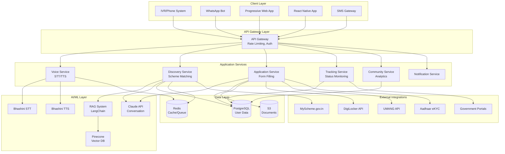
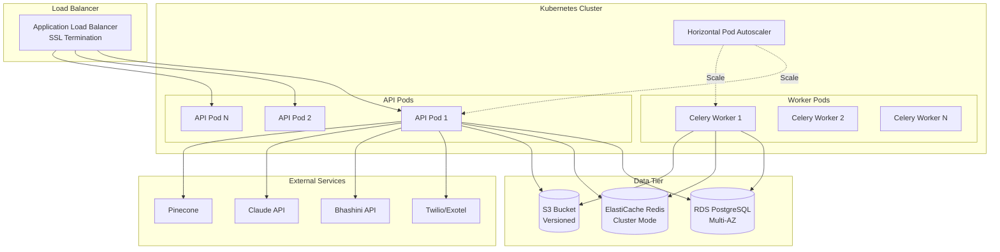

# Design Document: SamvidhanAI

## Overview

SamvidhanAI is a voice-first AI platform that democratizes access to government welfare schemes for India's 400M+ marginalized citizens. The system addresses the critical problem of ₹1.3 lakh crore in unclaimed welfare funds by providing an accessible, multi-language interface that guides users through scheme discovery, application, and tracking.

### Core Design Principles

1. **Voice-First**: All interactions prioritize voice over text, with voice as the primary interface
2. **Offline-Resilient**: System degrades gracefully to SMS/USSD when internet is unavailable
3. **Privacy-Preserving**: End-to-end encryption for sensitive data, federated learning for AI improvements
4. **Accessibility-Focused**: WCAG 2.1 AA compliant, works with assistive technologies
5. **Scalable**: Horizontally scalable microservices architecture supporting millions of users
6. **Government-Integrated**: Direct integration with DigiLocker, UMANG, Aadhaar eKYC

### System Context

The platform serves four primary user personas:
- **Illiterate domestic workers**: Feature phone, 2G connectivity, regional dialect speakers
- **Tribal farmers**: Basic smartphone, intermittent 3G, distrust of officials
- **Persons with disabilities**: Smartphone with screen reader, accessibility requirements
- **NGO field workers**: Manage 50+ families, need bulk operations and dashboards

## Architecture

### High-Level Architecture




### Technology Stack

**Backend Services:**
- **Framework**: FastAPI (Python 3.11+) - async support, automatic OpenAPI docs, high performance
- **Database**: PostgreSQL 15 - JSONB support for flexible schema, full-text search
- **Cache/Queue**: Redis 7 - caching, session storage, task queue (with Celery)
- **Object Storage**: AWS S3 / GCP Cloud Storage - document storage, backups

**AI/ML:**
- **LLM**: Claude API (Anthropic) - conversation management, form extraction
- **Speech-to-Text**: Bhashini API - 22 Indian languages, government-backed
- **Text-to-Speech**: Bhashini API - natural-sounding voices in Indian languages
- **RAG Framework**: LangChain - retrieval augmented generation pipeline
- **Vector Database**: Pinecone - semantic search for scheme information
- **OCR**: Tesseract + Google Vision API - document text extraction

**Frontend:**
- **Web**: Next.js 14 (React 18) - SSR, PWA support, TypeScript
- **Mobile**: React Native - iOS and Android from single codebase
- **UI Library**: Tailwind CSS + shadcn/ui - accessible components

**Voice/Communication:**
- **IVR**: Twilio / Exotel - phone system integration
- **WhatsApp**: WhatsApp Business API - chat interface
- **SMS**: Twilio / AWS SNS - fallback communication

**Infrastructure:**
- **Cloud**: AWS / GCP - compute, storage, networking
- **Containers**: Docker - application packaging
- **Orchestration**: Kubernetes - container orchestration, auto-scaling
- **CI/CD**: GitHub Actions - automated testing and deployment
- **Monitoring**: Prometheus + Grafana - metrics and alerting
- **Logging**: ELK Stack (Elasticsearch, Logstash, Kibana) - centralized logging

### Deployment Architecture




## Components and Interfaces

### 1. Voice Service

**Responsibility**: Handle voice interactions, speech-to-text, text-to-speech, language detection

**Key Components:**
- `VoiceController`: REST endpoints for voice interactions
- `SpeechToTextAdapter`: Interface to Bhashini STT API
- `TextToSpeechAdapter`: Interface to Bhashini TTS API
- `LanguageDetector`: Identify spoken language from audio
- `AudioProcessor`: Handle audio format conversion, noise reduction

**API Endpoints:**

```python
POST /api/v1/voice/transcribe
Request:
{
  "audio_data": "base64_encoded_audio",
  "audio_format": "wav|mp3|opus",
  "language_hint": "hi|en|ta|...",  # Optional
  "user_id": "uuid"
}
Response:
{
  "transcription": "मुझे पीएम किसान योजना के बारे में बताएं",
  "language": "hi",
  "confidence": 0.95,
  "duration_ms": 3500
}

POST /api/v1/voice/synthesize
Request:
{
  "text": "आपके लिए 5 योजनाएं उपलब्ध हैं",
  "language": "hi",
  "voice_gender": "female|male",
  "user_id": "uuid"
}
Response:
{
  "audio_data": "base64_encoded_audio",
  "audio_format": "mp3",
  "duration_ms": 2800
}

POST /api/v1/voice/detect-language
Request:
{
  "audio_data": "base64_encoded_audio",
  "audio_format": "wav"
}
Response:
{
  "language": "hi",
  "confidence": 0.92,
  "alternatives": [
    {"language": "ur", "confidence": 0.05},
    {"language": "pa", "confidence": 0.03}
  ]
}
```

**Internal Interfaces:**

```python
class ISpeechToText(ABC):
    @abstractmethod
    async def transcribe(
        self, 
        audio: bytes, 
        language: str,
        format: AudioFormat
    ) -> TranscriptionResult:
        pass

class ITextToSpeech(ABC):
    @abstractmethod
    async def synthesize(
        self,
        text: str,
        language: str,
        voice_config: VoiceConfig
    ) -> AudioResult:
        pass

@dataclass
class TranscriptionResult:
    text: str
    language: str
    confidence: float
    duration_ms: int
    word_timestamps: List[WordTimestamp]

@dataclass
class AudioResult:
    audio_data: bytes
    format: AudioFormat
    duration_ms: int
```

### 2. Discovery Service (Rights Discovery Engine)

**Responsibility**: Match users to eligible schemes, retrieve scheme information via RAG

**Key Components:**
- `DiscoveryController`: REST endpoints for scheme discovery
- `EligibilityMatcher`: Evaluate user profile against scheme criteria
- `RAGPipeline`: Retrieve and generate scheme information
- `SchemeRepository`: Database access for scheme data
- `VectorSearchAdapter`: Interface to Pinecone vector database

**API Endpoints:**

```python
POST /api/v1/discovery/match-schemes
Request:
{
  "user_profile": {
    "age": 45,
    "gender": "female",
    "state": "Jharkhand",
    "district": "Ranchi",
    "income_annual": 80000,
    "caste": "ST",
    "occupation": "farmer",
    "land_holding_acres": 2.5,
    "disability": null,
    "bpl_card": true,
    "ration_card_type": "antyodaya"
  },
  "language": "hi",
  "limit": 10
}
Response:
{
  "schemes": [
    {
      "scheme_id": "PM-KISAN-2024",
      "name": "प्रधानमंत्री किसान सम्मान निधि",
      "name_english": "PM-KISAN",
      "ministry": "Agriculture & Farmers Welfare",
      "benefit_amount": 6000,
      "benefit_frequency": "annual",
      "eligibility_score": 0.98,
      "description": "₹6000 प्रति वर्ष तीन किस्तों में",
      "required_documents": [
        "Aadhaar Card",
        "Land Ownership Document",
        "Bank Account Details"
      ],
      "application_url": "https://pmkisan.gov.in"
    },
    // ... more schemes
  ],
  "total_potential_benefit": 45000,
  "match_count": 5
}

GET /api/v1/discovery/scheme/{scheme_id}
Response:
{
  "scheme_id": "PM-KISAN-2024",
  "name": "प्रधानमंत्री किसान सम्मान निधि",
  "description": "Detailed description...",
  "eligibility_criteria": {
    "occupation": ["farmer"],
    "land_holding_max_acres": 5.0,
    "income_max": null
  },
  "benefits": {
    "amount": 6000,
    "frequency": "annual",
    "payment_mode": "DBT"
  },
  "documents_required": [...],
  "application_process": "Step by step...",
  "official_website": "https://pmkisan.gov.in",
  "last_updated": "2024-01-15T10:30:00Z"
}

POST /api/v1/discovery/ask
Request:
{
  "question": "मुझे किसान योजना के लिए क्या दस्तावेज चाहिए?",
  "language": "hi",
  "context": {
    "scheme_id": "PM-KISAN-2024",  # Optional
    "user_id": "uuid"
  }
}
Response:
{
  "answer": "पीएम किसान योजना के लिए आपको निम्नलिखित दस्तावेज चाहिए...",
  "sources": [
    {
      "title": "PM-KISAN Guidelines",
      "url": "https://pmkisan.gov.in/guidelines.pdf",
      "relevance": 0.94
    }
  ],
  "confidence": 0.91
}
```

**Internal Interfaces:**

```python
class IEligibilityMatcher(ABC):
    @abstractmethod
    async def match_schemes(
        self,
        user_profile: UserProfile,
        limit: int = 10
    ) -> List[SchemeMatch]:
        pass

class IRAGPipeline(ABC):
    @abstractmethod
    async def retrieve_and_generate(
        self,
        query: str,
        context: Dict[str, Any]
    ) -> RAGResponse:
        pass

@dataclass
class SchemeMatch:
    scheme: Scheme
    eligibility_score: float
    matching_criteria: List[str]
    missing_criteria: List[str]

@dataclass
class RAGResponse:
    answer: str
    sources: List[Source]
    confidence: float
```

### 3. Application Service

**Responsibility**: Guide form filling, extract data, generate PDFs, submit to government portals

**Key Components:**
- `ApplicationController`: REST endpoints for application management
- `ConversationalFormFiller`: LLM-based form filling conversation
- `DataExtractor`: Extract structured data from voice/text
- `OCRProcessor`: Extract text from document images
- `FormGenerator`: Generate PDF forms from templates
- `GovernmentPortalAdapter`: Submit to DigiLocker, UMANG, etc.

**API Endpoints:**

```python
POST /api/v1/applications/start
Request:
{
  "user_id": "uuid",
  "scheme_id": "PM-KISAN-2024",
  "language": "hi"
}
Response:
{
  "application_id": "uuid",
  "conversation_id": "uuid",
  "first_question": "आपका पूरा नाम क्या है?",
  "required_fields": [
    {"field": "full_name", "type": "text"},
    {"field": "aadhaar_number", "type": "aadhaar"},
    {"field": "bank_account", "type": "bank_account"},
    // ...
  ]
}

POST /api/v1/applications/{application_id}/respond
Request:
{
  "response": "मेरा नाम राम कुमार है",
  "response_type": "voice|text"
}
Response:
{
  "extracted_data": {
    "full_name": "राम कुमार"
  },
  "validation": {
    "is_valid": true,
    "confidence": 0.93
  },
  "next_question": "आपका आधार नंबर क्या है?",
  "progress": {
    "completed_fields": 1,
    "total_fields": 15,
    "percentage": 6.7
  }
}

POST /api/v1/applications/{application_id}/upload-document
Request: multipart/form-data
{
  "document_type": "aadhaar_card|ration_card|income_certificate|...",
  "file": <binary>
}
Response:
{
  "document_id": "uuid",
  "extracted_data": {
    "aadhaar_number": "1234 5678 9012",
    "name": "राम कुमार",
    "address": "..."
  },
  "ocr_confidence": 0.89,
  "requires_verification": false
}

POST /api/v1/applications/{application_id}/generate-pdf
Response:
{
  "pdf_url": "https://s3.../application_PM-KISAN_uuid.pdf",
  "expires_at": "2024-12-31T23:59:59Z"
}

POST /api/v1/applications/{application_id}/submit
Request:
{
  "submission_method": "digilocker|umang|offline",
  "aadhaar_otp": "123456"  # For eKYC
}
Response:
{
  "submission_id": "uuid",
  "acknowledgement_number": "PMKISAN/2024/123456",
  "status": "submitted",
  "submitted_at": "2024-01-20T14:30:00Z",
  "tracking_url": "https://pmkisan.gov.in/track/123456"
}

GET /api/v1/applications/{application_id}
Response:
{
  "application_id": "uuid",
  "user_id": "uuid",
  "scheme_id": "PM-KISAN-2024",
  "status": "draft|submitted|under_review|approved|rejected",
  "data": {...},
  "documents": [...],
  "created_at": "2024-01-20T10:00:00Z",
  "submitted_at": "2024-01-20T14:30:00Z"
}
```

**Internal Interfaces:**

```python
class IFormFiller(ABC):
    @abstractmethod
    async def process_response(
        self,
        application_id: str,
        user_response: str,
        context: ConversationContext
    ) -> FormFillingResult:
        pass

class IOCRProcessor(ABC):
    @abstractmethod
    async def extract_from_document(
        self,
        image: bytes,
        document_type: DocumentType
    ) -> OCRResult:
        pass

class IFormGenerator(ABC):
    @abstractmethod
    async def generate_pdf(
        self,
        application: Application,
        template: FormTemplate
    ) -> bytes:
        pass

class IGovernmentPortal(ABC):
    @abstractmethod
    async def submit_application(
        self,
        application: Application,
        credentials: PortalCredentials
    ) -> SubmissionResult:
        pass

@dataclass
class FormFillingResult:
    extracted_data: Dict[str, Any]
    validation: ValidationResult
    next_question: Optional[str]
    is_complete: bool

@dataclass
class OCRResult:
    extracted_text: str
    structured_data: Dict[str, Any]
    confidence: float
    bounding_boxes: List[BoundingBox]
```

### 4. Tracking Service

**Responsibility**: Monitor application status, scrape government portals, trigger escalations

**Key Components:**
- `TrackingController`: REST endpoints for status tracking
- `StatusScraper`: Scrape government portals for status updates
- `EscalationEngine`: Detect delays and trigger escalations
- `GrievanceGenerator`: Generate and file grievance applications
- `RTIGenerator`: Generate RTI applications

**API Endpoints:**

```python
GET /api/v1/tracking/applications/{application_id}/status
Response:
{
  "application_id": "uuid",
  "current_status": "under_review",
  "status_history": [
    {
      "status": "submitted",
      "timestamp": "2024-01-20T14:30:00Z",
      "notes": "Application received"
    },
    {
      "status": "under_review",
      "timestamp": "2024-01-25T09:15:00Z",
      "notes": "Document verification in progress"
    }
  ],
  "expected_completion_date": "2024-02-20",
  "days_elapsed": 10,
  "days_remaining": 21,
  "escalation_status": null
}

POST /api/v1/tracking/applications/{application_id}/escalate
Request:
{
  "escalation_type": "grievance|rti|legal_aid",
  "reason": "Application pending beyond expected time"
}
Response:
{
  "escalation_id": "uuid",
  "type": "grievance",
  "grievance_number": "CPGRAMS/2024/789012",
  "filed_at": "2024-02-15T11:00:00Z",
  "expected_response_date": "2024-03-01"
}

GET /api/v1/tracking/dashboard
Query params: ?user_id=uuid&field_worker_id=uuid
Response:
{
  "summary": {
    "total_applications": 47,
    "pending": 12,
    "approved": 30,
    "rejected": 5,
    "total_amount_unlocked": 285000
  },
  "applications": [
    {
      "application_id": "uuid",
      "scheme_name": "PM-KISAN",
      "applicant_name": "राम कुमार",
      "status": "approved",
      "benefit_amount": 6000,
      "submitted_date": "2024-01-20",
      "approval_date": "2024-02-10"
    },
    // ...
  ],
  "alerts": [
    {
      "application_id": "uuid",
      "alert_type": "delay",
      "message": "Application pending for 45 days",
      "action_required": "escalate"
    }
  ]
}
```

**Internal Interfaces:**

```python
class IStatusScraper(ABC):
    @abstractmethod
    async def scrape_status(
        self,
        application: Application,
        portal_config: PortalConfig
    ) -> StatusUpdate:
        pass

class IEscalationEngine(ABC):
    @abstractmethod
    async def evaluate_escalation(
        self,
        application: Application
    ) -> Optional[EscalationAction]:
        pass

class IGrievanceGenerator(ABC):
    @abstractmethod
    async def generate_grievance(
        self,
        application: Application,
        reason: str
    ) -> GrievanceDocument:
        pass

@dataclass
class StatusUpdate:
    status: ApplicationStatus
    timestamp: datetime
    notes: str
    source: str  # portal URL or API

@dataclass
class EscalationAction:
    type: EscalationType  # GRIEVANCE, RTI, LEGAL_AID
    reason: str
    priority: int
    auto_execute: bool
```

### 5. Community Service

**Responsibility**: Aggregate community statistics, detect patterns, enable peer support

**Key Components:**
- `CommunityController`: REST endpoints for community features
- `StatisticsAggregator`: Calculate community metrics
- `PatternDetector`: Detect corruption and anomalies
- `FederatedLearningCoordinator`: Privacy-preserving model updates

**API Endpoints:**

```python
GET /api/v1/community/statistics
Query params: ?village=X&district=Y&state=Z
Response:
{
  "location": {
    "village": "Bero",
    "district": "Ranchi",
    "state": "Jharkhand"
  },
  "metrics": {
    "total_users": 47,
    "total_applications": 156,
    "approved_applications": 98,
    "total_amount_unlocked": 1247000,
    "approval_rate": 0.628,
    "avg_processing_days": 28
  },
  "top_schemes": [
    {
      "scheme_name": "PM-KISAN",
      "applications": 45,
      "approvals": 42,
      "amount_unlocked": 252000
    },
    // ...
  ],
  "recent_successes": [
    {
      "scheme_name": "PM Awas Yojana",
      "benefit_amount": 120000,
      "approved_date": "2024-01-15",
      "anonymized": true
    }
  ]
}

GET /api/v1/community/patterns
Query params: ?type=corruption|delay|rejection
Response:
{
  "patterns": [
    {
      "pattern_id": "uuid",
      "type": "high_rejection_rate",
      "location": "Ranchi District Office",
      "officer_id": "anonymized_xyz",
      "metric": {
        "rejection_rate": 0.87,
        "baseline_rate": 0.15,
        "applications_affected": 134
      },
      "confidence": 0.94,
      "detected_at": "2024-01-20T10:00:00Z",
      "status": "flagged_for_review"
    }
  ]
}

POST /api/v1/community/share-story
Request:
{
  "user_id": "uuid",
  "application_id": "uuid",
  "story": "मुझे पीएम किसान योजना से ₹6000 मिले...",
  "consent": true,
  "anonymize": true
}
Response:
{
  "story_id": "uuid",
  "status": "published",
  "visibility": "community"
}
```


### 6. Notification Service

**Responsibility**: Send notifications via voice, WhatsApp, SMS, push notifications

**Key Components:**
- `NotificationController`: REST endpoints for notification management
- `NotificationDispatcher`: Route notifications to appropriate channels
- `TemplateEngine`: Generate localized notification content
- `DeliveryTracker`: Track notification delivery and retries

**API Endpoints:**

```python
POST /api/v1/notifications/send
Request:
{
  "user_id": "uuid",
  "type": "status_update|reminder|escalation|success",
  "channel": "voice|whatsapp|sms|push|auto",
  "language": "hi",
  "data": {
    "application_id": "uuid",
    "scheme_name": "PM-KISAN",
    "status": "approved",
    "benefit_amount": 6000
  }
}
Response:
{
  "notification_id": "uuid",
  "status": "sent|queued|failed",
  "channel_used": "whatsapp",
  "sent_at": "2024-01-20T15:00:00Z"
}

GET /api/v1/notifications/preferences/{user_id}
Response:
{
  "user_id": "uuid",
  "preferences": {
    "primary_channel": "whatsapp",
    "fallback_channel": "sms",
    "frequency": "immediate|daily|weekly",
    "quiet_hours": {
      "start": "22:00",
      "end": "08:00"
    },
    "notification_types": {
      "status_updates": true,
      "reminders": true,
      "community_updates": false
    }
  }
}
```

## Data Models

### Database Schema (PostgreSQL)

```sql
-- Users table
CREATE TABLE users (
    id UUID PRIMARY KEY DEFAULT gen_random_uuid(),
    mobile_number VARCHAR(15) UNIQUE NOT NULL,
    aadhaar_number_encrypted BYTEA,  -- Encrypted
    name VARCHAR(255),
    age INTEGER,
    gender VARCHAR(10),
    state VARCHAR(100),
    district VARCHAR(100),
    village VARCHAR(100),
    pincode VARCHAR(10),
    income_annual INTEGER,
    caste VARCHAR(20),
    occupation VARCHAR(100),
    disability VARCHAR(100),
    bpl_card BOOLEAN DEFAULT FALSE,
    ration_card_type VARCHAR(50),
    preferred_language VARCHAR(10) DEFAULT 'hi',
    preferred_channel VARCHAR(20) DEFAULT 'whatsapp',
    created_at TIMESTAMP DEFAULT NOW(),
    updated_at TIMESTAMP DEFAULT NOW(),
    last_active_at TIMESTAMP,
    is_active BOOLEAN DEFAULT TRUE
);

CREATE INDEX idx_users_mobile ON users(mobile_number);
CREATE INDEX idx_users_location ON users(state, district, village);
CREATE INDEX idx_users_demographics ON users(caste, income_annual, occupation);

-- Schemes table
CREATE TABLE schemes (
    id UUID PRIMARY KEY DEFAULT gen_random_uuid(),
    scheme_id VARCHAR(100) UNIQUE NOT NULL,
    name JSONB NOT NULL,  -- {"en": "PM-KISAN", "hi": "पीएम किसान", ...}
    description JSONB NOT NULL,
    ministry VARCHAR(255),
    scheme_type VARCHAR(50),  -- central, state, district
    state VARCHAR(100),  -- NULL for central schemes
    eligibility_criteria JSONB NOT NULL,
    benefits JSONB NOT NULL,
    documents_required JSONB NOT NULL,
    application_process JSONB,
    official_website VARCHAR(500),
    application_url VARCHAR(500),
    is_active BOOLEAN DEFAULT TRUE,
    last_updated TIMESTAMP DEFAULT NOW(),
    created_at TIMESTAMP DEFAULT NOW()
);

CREATE INDEX idx_schemes_type ON schemes(scheme_type, state);
CREATE INDEX idx_schemes_active ON schemes(is_active);
CREATE INDEX idx_schemes_eligibility ON schemes USING GIN (eligibility_criteria);

-- Applications table
CREATE TABLE applications (
    id UUID PRIMARY KEY DEFAULT gen_random_uuid(),
    user_id UUID NOT NULL REFERENCES users(id) ON DELETE CASCADE,
    scheme_id UUID NOT NULL REFERENCES schemes(id),
    status VARCHAR(50) NOT NULL DEFAULT 'draft',
    -- draft, submitted, under_review, approved, rejected, escalated
    application_data JSONB NOT NULL,
    documents JSONB,  -- Array of document references
    submission_method VARCHAR(50),  -- digilocker, umang, offline
    acknowledgement_number VARCHAR(255),
    tracking_url VARCHAR(500),
    expected_completion_date DATE,
    benefit_amount INTEGER,
    created_at TIMESTAMP DEFAULT NOW(),
    submitted_at TIMESTAMP,
    completed_at TIMESTAMP,
    updated_at TIMESTAMP DEFAULT NOW()
);

CREATE INDEX idx_applications_user ON applications(user_id);
CREATE INDEX idx_applications_scheme ON applications(scheme_id);
CREATE INDEX idx_applications_status ON applications(status);
CREATE INDEX idx_applications_dates ON applications(submitted_at, expected_completion_date);

-- Application status history
CREATE TABLE application_status_history (
    id UUID PRIMARY KEY DEFAULT gen_random_uuid(),
    application_id UUID NOT NULL REFERENCES applications(id) ON DELETE CASCADE,
    status VARCHAR(50) NOT NULL,
    notes TEXT,
    source VARCHAR(100),  -- portal_scrape, api, manual, user_update
    created_at TIMESTAMP DEFAULT NOW()
);

CREATE INDEX idx_status_history_application ON application_status_history(application_id, created_at DESC);

-- Escalations table
CREATE TABLE escalations (
    id UUID PRIMARY KEY DEFAULT gen_random_uuid(),
    application_id UUID NOT NULL REFERENCES applications(id) ON DELETE CASCADE,
    type VARCHAR(50) NOT NULL,  -- grievance, rti, legal_aid
    reason TEXT NOT NULL,
    grievance_number VARCHAR(255),
    rti_number VARCHAR(255),
    status VARCHAR(50) DEFAULT 'filed',
    filed_at TIMESTAMP DEFAULT NOW(),
    expected_response_date DATE,
    resolved_at TIMESTAMP,
    resolution_notes TEXT
);

CREATE INDEX idx_escalations_application ON escalations(application_id);
CREATE INDEX idx_escalations_status ON escalations(status, expected_response_date);

-- Documents table
CREATE TABLE documents (
    id UUID PRIMARY KEY DEFAULT gen_random_uuid(),
    user_id UUID NOT NULL REFERENCES users(id) ON DELETE CASCADE,
    application_id UUID REFERENCES applications(id) ON DELETE SET NULL,
    document_type VARCHAR(100) NOT NULL,
    file_path VARCHAR(500) NOT NULL,  -- S3 path
    file_size INTEGER,
    mime_type VARCHAR(100),
    ocr_text TEXT,
    extracted_data JSONB,
    ocr_confidence FLOAT,
    uploaded_at TIMESTAMP DEFAULT NOW(),
    is_verified BOOLEAN DEFAULT FALSE
);

CREATE INDEX idx_documents_user ON documents(user_id);
CREATE INDEX idx_documents_application ON documents(application_id);
CREATE INDEX idx_documents_type ON documents(document_type);

-- Notifications table
CREATE TABLE notifications (
    id UUID PRIMARY KEY DEFAULT gen_random_uuid(),
    user_id UUID NOT NULL REFERENCES users(id) ON DELETE CASCADE,
    type VARCHAR(50) NOT NULL,
    channel VARCHAR(20) NOT NULL,
    language VARCHAR(10) NOT NULL,
    content JSONB NOT NULL,
    status VARCHAR(50) DEFAULT 'queued',
    sent_at TIMESTAMP,
    delivered_at TIMESTAMP,
    failed_at TIMESTAMP,
    retry_count INTEGER DEFAULT 0,
    error_message TEXT,
    created_at TIMESTAMP DEFAULT NOW()
);

CREATE INDEX idx_notifications_user ON notifications(user_id, created_at DESC);
CREATE INDEX idx_notifications_status ON notifications(status, created_at);

-- Community statistics (aggregated)
CREATE TABLE community_statistics (
    id UUID PRIMARY KEY DEFAULT gen_random_uuid(),
    location_type VARCHAR(20) NOT NULL,  -- village, district, state
    location_value VARCHAR(255) NOT NULL,
    metric_date DATE NOT NULL,
    total_users INTEGER DEFAULT 0,
    total_applications INTEGER DEFAULT 0,
    approved_applications INTEGER DEFAULT 0,
    rejected_applications INTEGER DEFAULT 0,
    total_amount_unlocked BIGINT DEFAULT 0,
    avg_processing_days FLOAT,
    top_schemes JSONB,
    created_at TIMESTAMP DEFAULT NOW(),
    UNIQUE(location_type, location_value, metric_date)
);

CREATE INDEX idx_community_stats_location ON community_statistics(location_type, location_value, metric_date DESC);

-- Corruption patterns
CREATE TABLE corruption_patterns (
    id UUID PRIMARY KEY DEFAULT gen_random_uuid(),
    pattern_type VARCHAR(50) NOT NULL,
    location VARCHAR(255),
    officer_id_anonymized VARCHAR(255),
    metric_data JSONB NOT NULL,
    confidence FLOAT NOT NULL,
    status VARCHAR(50) DEFAULT 'detected',
    detected_at TIMESTAMP DEFAULT NOW(),
    reviewed_at TIMESTAMP,
    reviewer_notes TEXT
);

CREATE INDEX idx_patterns_status ON corruption_patterns(status, detected_at DESC);

-- Audit logs
CREATE TABLE audit_logs (
    id UUID PRIMARY KEY DEFAULT gen_random_uuid(),
    user_id UUID REFERENCES users(id) ON DELETE SET NULL,
    action VARCHAR(100) NOT NULL,
    resource_type VARCHAR(50),
    resource_id UUID,
    ip_address INET,
    user_agent TEXT,
    request_data JSONB,
    response_status INTEGER,
    created_at TIMESTAMP DEFAULT NOW()
);

CREATE INDEX idx_audit_logs_user ON audit_logs(user_id, created_at DESC);
CREATE INDEX idx_audit_logs_resource ON audit_logs(resource_type, resource_id);
CREATE INDEX idx_audit_logs_action ON audit_logs(action, created_at DESC);

-- Field workers table
CREATE TABLE field_workers (
    id UUID PRIMARY KEY DEFAULT gen_random_uuid(),
    user_id UUID NOT NULL REFERENCES users(id) ON DELETE CASCADE,
    organization_name VARCHAR(255),
    organization_type VARCHAR(100),
    verification_status VARCHAR(50) DEFAULT 'pending',
    verified_at TIMESTAMP,
    created_at TIMESTAMP DEFAULT NOW()
);

CREATE INDEX idx_field_workers_user ON field_workers(user_id);

-- Field worker managed users (many-to-many)
CREATE TABLE field_worker_users (
    field_worker_id UUID NOT NULL REFERENCES field_workers(id) ON DELETE CASCADE,
    managed_user_id UUID NOT NULL REFERENCES users(id) ON DELETE CASCADE,
    added_at TIMESTAMP DEFAULT NOW(),
    PRIMARY KEY (field_worker_id, managed_user_id)
);

CREATE INDEX idx_fw_users_worker ON field_worker_users(field_worker_id);
CREATE INDEX idx_fw_users_managed ON field_worker_users(managed_user_id);

-- Conversations (for form filling)
CREATE TABLE conversations (
    id UUID PRIMARY KEY DEFAULT gen_random_uuid(),
    user_id UUID NOT NULL REFERENCES users(id) ON DELETE CASCADE,
    application_id UUID REFERENCES applications(id) ON DELETE SET NULL,
    language VARCHAR(10) NOT NULL,
    status VARCHAR(50) DEFAULT 'active',
    context JSONB,
    created_at TIMESTAMP DEFAULT NOW(),
    updated_at TIMESTAMP DEFAULT NOW(),
    completed_at TIMESTAMP
);

CREATE INDEX idx_conversations_user ON conversations(user_id, created_at DESC);
CREATE INDEX idx_conversations_application ON conversations(application_id);

-- Conversation messages
CREATE TABLE conversation_messages (
    id UUID PRIMARY KEY DEFAULT gen_random_uuid(),
    conversation_id UUID NOT NULL REFERENCES conversations(id) ON DELETE CASCADE,
    role VARCHAR(20) NOT NULL,  -- user, assistant, system
    content TEXT NOT NULL,
    content_type VARCHAR(20) DEFAULT 'text',  -- text, audio
    metadata JSONB,
    created_at TIMESTAMP DEFAULT NOW()
);

CREATE INDEX idx_messages_conversation ON conversation_messages(conversation_id, created_at);
```

### Redis Data Structures

```python
# Session management
session:{user_id} = {
    "user_id": "uuid",
    "mobile_number": "9876543210",
    "language": "hi",
    "last_activity": "2024-01-20T15:30:00Z",
    "context": {...}
}
TTL: 30 minutes

# Rate limiting
rate_limit:{user_id}:{endpoint} = counter
TTL: 1 hour

# Cache: Scheme data
scheme:{scheme_id} = {
    "scheme_id": "PM-KISAN-2024",
    "name": {...},
    "eligibility_criteria": {...},
    ...
}
TTL: 24 hours

# Cache: User profile
user_profile:{user_id} = {
    "user_id": "uuid",
    "name": "राम कुमार",
    "demographics": {...}
}
TTL: 1 hour

# Task queue (Celery)
celery:task:{task_id} = {
    "task": "scrape_application_status",
    "args": ["application_id"],
    "status": "pending|running|success|failure"
}

# Voice call state
voice_call:{call_id} = {
    "user_id": "uuid",
    "state": "greeting|language_detection|discovery|application|...",
    "context": {...}
}
TTL: 1 hour
```

### Vector Database Schema (Pinecone)

```python
# Scheme embeddings
{
    "id": "scheme:PM-KISAN-2024",
    "values": [0.123, -0.456, ...],  # 1536-dim embedding
    "metadata": {
        "scheme_id": "PM-KISAN-2024",
        "name_en": "PM-KISAN",
        "name_hi": "पीएम किसान",
        "ministry": "Agriculture",
        "scheme_type": "central",
        "benefit_amount": 6000,
        "eligibility_keywords": ["farmer", "land", "agriculture"],
        "text_chunk": "Full text description...",
        "source_url": "https://pmkisan.gov.in"
    }
}

# FAQ embeddings
{
    "id": "faq:PM-KISAN:documents",
    "values": [0.234, -0.567, ...],
    "metadata": {
        "scheme_id": "PM-KISAN-2024",
        "question": "What documents are required?",
        "answer": "Aadhaar card, land ownership document...",
        "language": "en",
        "category": "documents"
    }
}
```

## Correctness Properties

*A property is a characteristic or behavior that should hold true across all valid executions of a system—essentially, a formal statement about what the system should do. Properties serve as the bridge between human-readable specifications and machine-verifiable correctness guarantees.*

### Property 1: Voice Transcription Accuracy (Validates: Requirements 1.3, 15.1)
**Property:** For any audio input in a supported language with clear speech, transcription accuracy SHALL be ≥95%.
**Test Strategy:** Generate synthetic speech samples in all 22 languages, transcribe them, and compare against ground truth using word error rate (WER).

### Property 2: Language Detection Consistency (Validates: Requirements 1.2, 1.5)
**Property:** For any audio sample, language detection SHALL return the same result when called multiple times with identical input.
**Test Strategy:** Record audio samples in each language, call detection API repeatedly, verify consistent results.

### Property 3: Scheme Matching Completeness (Validates: Requirements 2.1, 2.2)
**Property:** For any user profile, the discovery engine SHALL return ALL schemes where the user meets 100% of eligibility criteria.
**Test Strategy:** Generate user profiles with known eligibility, verify all matching schemes are returned.

### Property 4: Scheme Matching Correctness (Validates: Requirements 2.2, 2.3)
**Property:** For any scheme in the returned list, the user profile SHALL satisfy all mandatory eligibility criteria.
**Test Strategy:** For each returned scheme, verify user profile matches all criteria in scheme.eligibility_criteria.

### Property 5: Data Extraction Idempotency (Validates: Requirements 3.3, 3.4)
**Property:** Extracting data from the same voice response multiple times SHALL produce identical structured data.
**Test Strategy:** Process same voice input repeatedly, verify extracted fields are identical across runs.

### Property 6: Form Generation Round-Trip (Validates: Requirements 3.7, 24.8)
**Property:** For any valid application data, generating a PDF then parsing the PDF SHALL produce equivalent application data.
**Test Strategy:** Generate application data, create PDF, OCR the PDF, compare extracted data with original.

### Property 7: Encryption Reversibility (Validates: Requirements 8.1, 8.2)
**Property:** For any sensitive data (Aadhaar, PAN), encrypting then decrypting SHALL return the original data.
**Test Strategy:** Encrypt various sensitive strings, decrypt them, verify equality with original.

### Property 8: Authentication Token Expiry (Validates: Requirements 8.3, 17.7)
**Property:** Any JWT token SHALL be rejected after its expiration time.
**Test Strategy:** Generate tokens with short expiry, wait for expiry, verify API calls are rejected.

### Property 9: Rate Limiting Enforcement (Validates: Requirements 8.9)
**Property:** Any user making >100 requests per hour SHALL receive HTTP 429 responses.
**Test Strategy:** Make 101 requests rapidly from same user, verify 101st request is rate-limited.

### Property 10: Offline Queue Synchronization (Validates: Requirements 9.2)
**Property:** For any queued user input during offline mode, data SHALL be synced when connectivity is restored without loss.
**Test Strategy:** Queue operations while offline, restore connectivity, verify all operations are executed.

### Property 11: Notification Delivery Guarantee (Validates: Requirements 18.1, 18.8)
**Property:** For any notification, the system SHALL attempt delivery at least once and retry up to 3 times on failure.
**Test Strategy:** Simulate notification failures, verify retry attempts are made with proper backoff.

### Property 12: Status Update Propagation (Validates: Requirements 5.2, 5.4)
**Property:** When application status changes in the database, a notification SHALL be queued within 1 second.
**Test Strategy:** Update application status, verify notification appears in queue within time limit.

### Property 13: Escalation Trigger Timing (Validates: Requirements 6.1)
**Property:** For any application pending >30 days beyond expected time, an escalation SHALL be automatically initiated.
**Test Strategy:** Create applications with past expected dates, run escalation job, verify escalations are created.

### Property 14: Data Deletion Completeness (Validates: Requirements 8.5)
**Property:** When a user requests data deletion, ALL personal data SHALL be removed from all tables within 30 days.
**Test Strategy:** Create user with data across tables, request deletion, verify no personal data remains.

### Property 15: Audit Log Immutability (Validates: Requirements 8.7, 21.5)
**Property:** Once written, audit log entries SHALL never be modified or deleted.
**Test Strategy:** Create audit logs, attempt updates/deletes, verify operations fail or are logged.

### Property 16: Concurrent Request Handling (Validates: Requirements 11.1, 11.2)
**Property:** The system SHALL handle 10,000 concurrent requests without response time exceeding 5 seconds.
**Test Strategy:** Load test with 10,000 concurrent users, measure response times, verify <5s.

### Property 17: Cache Consistency (Validates: Requirements 11.5)
**Property:** For any cached data, the cache value SHALL match the database value or be invalidated within TTL.
**Test Strategy:** Update database, verify cache is invalidated or matches new value within TTL.

### Property 18: Document OCR Confidence Threshold (Validates: Requirements 16.6)
**Property:** When OCR confidence is <80%, the system SHALL request user confirmation.
**Test Strategy:** Process low-quality document images, verify confirmation prompts are triggered.

### Property 19: Multi-Channel Data Consistency (Validates: Requirements 12.7)
**Property:** User data modified via one channel SHALL be immediately visible on all other channels.
**Test Strategy:** Update profile via WhatsApp, verify changes appear in web dashboard and mobile app.

### Property 20: Scheme Database Freshness (Validates: Requirements 2.6, 14.1)
**Property:** Scheme data SHALL be updated within 24 hours of changes on government websites.
**Test Strategy:** Mock government website changes, run scraper, verify updates appear within 24h.

## Testing Framework

**Property-Based Testing Library:** `hypothesis` (Python) for backend services, `fast-check` (TypeScript) for frontend

**Test Execution:**
- Properties SHALL be tested on every commit via CI/CD pipeline
- Each property SHALL run with minimum 100 random test cases
- Failed properties SHALL block deployment to production

**Test Data Generation:**
- Use realistic Indian names, addresses, and phone numbers
- Generate valid Aadhaar numbers (12 digits) for testing (test data only, not real)
- Create synthetic audio samples in all 22 languages
- Generate document images with varying quality levels

